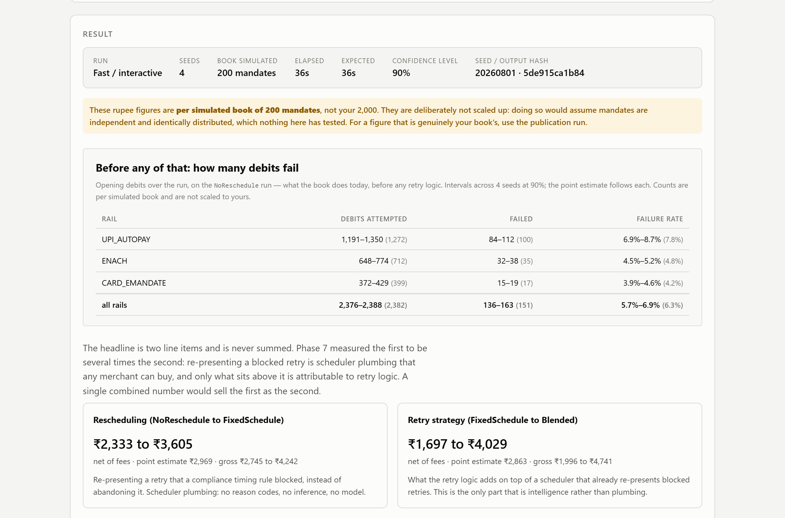
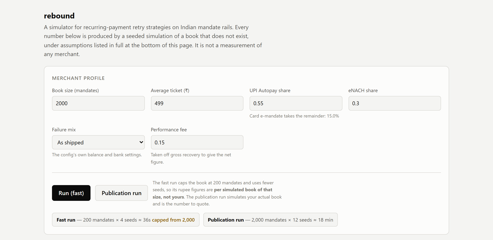
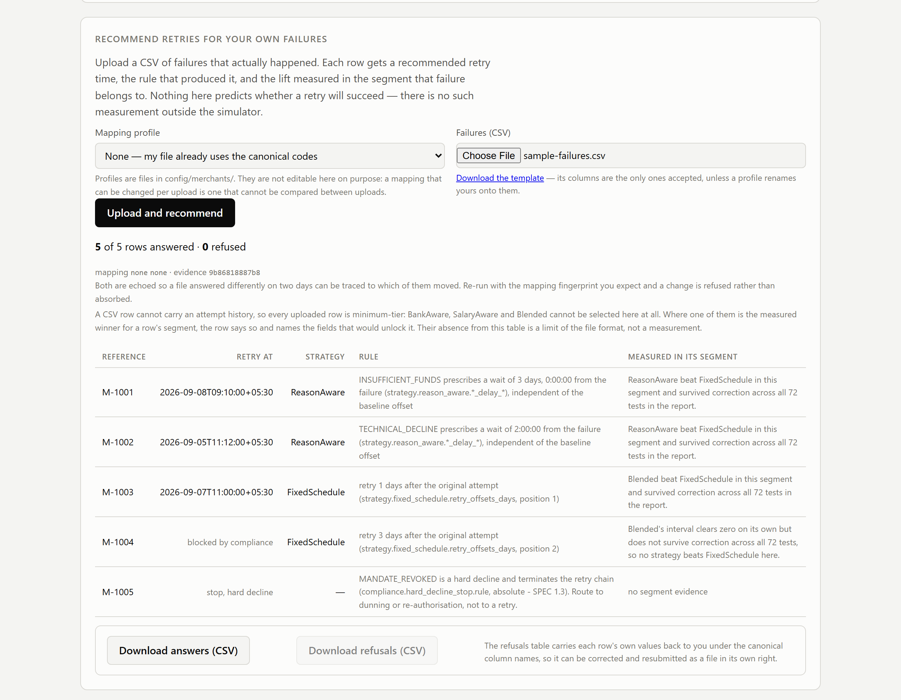

# rebound

**A discrete-event simulator and scoring service for recurring-payment retry recovery in India.**

`rebound` answers one question with measurement rather than assertion: *when a UPI AutoPay, eNACH or card e-mandate debit fails, what is a better retry policy actually worth?*

It ships two things:

| Component | What it does | Data |
|---|---|---|
| **Simulator** | Generates a synthetic mandate book, runs 12 months of billing, and measures competing retry strategies against each other under identical conditions | Synthetic only |
| **Scoring service** | Takes an observed failure and returns a recommended retry time, the rule that produced it, and the measured evidence for that segment | Real merchant data |

**[Pitch deck (PPTX)](rebound-pitch.pptx)**: the product case in slides. The rest of this README is the engineering.



| Merchant profile and run options | Scoring service answering uploaded failures |
|---|---|
|  |  |

> [!IMPORTANT]
> **Every figure this project produces is simulated.** No merchant's real book has been measured. The assumptions are documented, versioned and swept — but they are assumptions. See [Limitations](#limitations) before quoting any number.

---

## Why this exists

Recovery benchmarks in this category — "smart retry recovers 40%", "70% with dunning" — are self-reported, US-centric, and measured against a card-expiry-driven baseline that barely exists in India. UPI AutoPay is stateless and settles in real time; there is no pre-authorisation to lean on and no card-updater analogue. Nobody has published rigorous, India-specific retry-lift data.

This is an attempt to produce some, with the measurement layer built and audited *before* any strategy was written.

## Headline findings

All figures are simulated. Intervals are 90% paired bootstrap over 24 seeds.

### 1. The money is in plumbing, not intelligence

| Failure profile | Rescheduling lift | Strategy lift |
|---|---|---|
| As shipped (mixed) | +6.78pp | +1.64pp |
| Insufficient-funds dominant | +6.43pp | +3.54pp |
| Technical dominant | +5.75pp | +0.38pp |

**Rescheduling** — re-presenting a retry that a compliance timing rule blocked, instead of abandoning it — is worth roughly 4× the best retry logic under a mixed profile, and it is the only lift significant under every profile. It needs no reason codes, no inference and no model. It is a calendar lookup.

**The two figures are never summed**, in the model, the API or the interface. `LiftDecomposition` deliberately exposes no `total`, with a test pinning that. Quoting a combined number would sell scheduler plumbing as intelligence.

### 2. Strategy value is contingent on failure mix

Strategy lift swings ~17× between the best and worst reason-code mix. In practice this makes *"what is your dominant failure reason code?"* a qualifying question, not a footnote.

### 3. Salary-timed retries cannot be built from merchant data

Every mandate bills on one calendar day, so its observable history is that day repeated. Nothing in it separates "payday is the 25th" from "payday is the 5th". The estimator collapses onto the billing day for ~94% of mandates and lands within 2 days of true payroll **14.2%** of the time — worse than a uniform random guess at **17.9%**.

This is an identifiability failure, not a tuning problem. The failing estimator and its test are kept deliberately, as documentation of why. Salary timing requires an external source: account-aggregator consent, a signup declaration, or an issuer signal.

Consequence: `INSUFFICIENT_FUNDS` is the largest failure segment at ~40% of episodes, and no strategy beats the baseline in it after correction. **The largest pocket of opportunity is blocked on external data, not on better algorithms.**

---

## How the measurement works

The credibility of everything above rests on four controls. Each of them changed a conclusion during development.

**Negative control.** A segmentation axis known to carry no signal (`ρ < 0.04` against every driver) is tested alongside the real ones. On its first run it produced two apparent winners at the raw level — both killed by correction. It is a permanent live test of the significance machinery: if anything ever wins on that axis, the suite fails.

**Multiplicity correction.** One Bonferroni family across all segment tests. No uncorrected column is published anywhere, because the uncorrected column is the one that ends up in a deck.

**Sensitivity analysis.** Load-bearing assumptions swept at powered sizing. The result names which assumptions the conclusion is fragile to — and the two most fragile are `population.balance.*`, the least empirically grounded part of the model. A sweep whose base effect does not clear zero raises `UnderpoweredSweepError` rather than emitting a ranking of noise.

**Reproducibility.** Same seed, byte-identical output. Every export carries the config fingerprint it was produced under and refuses on mismatch. A route-enumeration test fails the build if a new simulating endpoint ships without one.

### Strategies

| Strategy | Reads | Role |
|---|---|---|
| `NoRetry` | — | Floor |
| `NoReschedule` | — | What a merchant runs today; abandons blocked retries |
| `FixedSchedule` | — | Baseline: T+1, T+3, T+7. **Frozen — never gains reason-code logic** |
| `ReasonAware` | Reason code | Branches on why it failed |
| `SalaryAware` | Attempt history | Infers payday. Does not work — see Finding 3 |
| `BankAware` | Bank, hour | Learns per-bank success windows |
| `Blended` | All of the above | Scores candidate times across signals |

Strategies receive a `CustomerObservable` — a distinct type that makes reading true simulator state a type error rather than a convention. A strategy that needs ground truth to work is a finding, not an obstacle.

---

## Quick start

```bash
git clone https://github.com/karthikraoofficial/Autopay_recovery_simulator-recommender.git rebound && cd rebound
python -m venv .venv && source .venv/bin/activate   # Windows: .venv\Scripts\activate
pip install -e ".[dev]"
pytest -q

# API
uvicorn rebound.api.app:app --port 8000 --reload

# Dashboard
cd web && npm install && npm run dev
```

Open http://localhost:5173.

> [!WARNING]
> `--reload` does **not** reliably prevent stale processes. Its watcher lives in a supervisor process; a killed or detached supervisor leaves the worker serving whatever it last imported, silently and indefinitely. `GET /health` reports the commit the process booted from, and the dashboard shows a banner when it disagrees with the build. Trust the banner, not the flag.

### Running a simulation

Six inputs: book size, average ticket, UPI share, eNACH share, failure mix, performance fee. Two modes:

- **Interactive** — capped book size, fewer seeds, visibly wider intervals. The interval width is the honest signal of what a cheap run bought.
- **Publication** — the merchant's actual book size at powered sizing. Slower; runs in the background with a duration estimate.

There is no caching. A cache would hide the cost that the interval width is there to communicate.

### Trying the scoring service

[`examples/sample-failures.csv`](examples/sample-failures.csv) holds five made-up failures, one per interesting path: a reason-aware wait, a technical retry, an eNACH row with a batch cutoff, a retry blocked by compliance, and a hard decline that stops the chain. Upload it under *Recommend retries for your own failures*, or send it to the API directly:

```bash
curl -X POST -H "Content-Type: text/csv" --data-binary @examples/sample-failures.csv \
  http://localhost:8001/recommend/batch
```

---

## API

| Endpoint | Purpose |
|---|---|
| `POST /simulate` | Run the simulator; returns the two lift items with intervals |
| `GET /segments` | Per-segment analysis with multiplicity correction (`?format=text`) |
| `GET /trace` | Per-attempt trace for one seed (`?format=csv`) |
| `POST /recommend` | Single observed failure → recommended retry time |
| `POST /recommend/batch` | CSV of failures → recommendations + refusals |
| `GET /recommend/template` | Input template and column contract |
| `GET /recommend/mappings` | Available per-merchant mapping profiles |
| `GET /assumptions` | Every assumption with source and confidence |
| `GET /health` | Boot commit, dirty flag, config fingerprint |

### Scoring service contract

Three rules govern `/recommend`, and none of them bend:

1. **Refuse, never default.** Any field a strategy or the compliance guard needs that the input lacks produces a refusal naming the field. No synthesised history, no assumed values.
2. **No outcome prediction.** The service recommends a *time*. It emits no success probability — there is no oracle outside the simulator, and a probability derived from a simulated engine has no standing against a real customer.
3. **Evidence is segment-level, and says so.** A rule has no measured lift of its own; what was measured is the lift in the segment the failure belongs to. Responses name both, and say *"no strategy beats the baseline here"* where that is what was measured.

### Input tiers

**Minimum tier** — serves `FixedSchedule` and `ReasonAware`:
`mandate_ref`, `rail`, `reason_code`, `failed_at`, `amount_paise`, `mandate_cap_paise`, `attempt_number`, `notified_at`, `prior_failure_count`, `original_attempt_at`

**Extended tier** — additionally unlocks `BankAware`, `SalaryAware`, `Blended`:
`bank_id`, full attempt history for the cycle, `bank_batch_cutoff_time` (eNACH)

On a minimum-tier input the response names which strategies were unavailable and which fields would unlock them, rather than quietly returning a weaker answer.

> [!NOTE]
> **A CSV row cannot carry an attempt history**, so every batch row is minimum-tier by construction. `BankAware`, `SalaryAware` and `Blended` can never be selected from a CSV upload. Their absence from a batch result is a limit of the file format, not a measurement.

### Timestamp rules — the two are opposite

| Field | Rule | Why |
|---|---|---|
| `failed_at`, `notified_at`, `original_attempt_at` | **Must** carry an offset | They are instants |
| `bank_batch_cutoff_time` | **Must not** carry an offset | It is the bank's own wall-clock time |

Writing `02:00:00Z` instead of `02:00:00` is refused rather than reinterpreted: dropping or converting an offset would move the presentation-window decision by up to 14 hours, and that rule decides which *day* a real debit is presented.

### Batch ingestion

File-level defects — unknown columns, wrong delimiter, bad encoding, missing header — refuse the **whole file** with one message naming the defect. A 4,000-row file returning 4,000 identical refusals is noise burying a one-line problem.

Row-level defects refuse that row, with the row number, column, offending value and expectation. Valid rows are still processed; refused rows echo their input, so the errors file is itself a valid upload once corrected.

Unmapped reason codes and rails are **refused, never guessed**. `DECLINED_BY_BANK` could be a technical decline or a frozen account, and mapping it silently would change the recommendation. Per-merchant vocabularies live in `config/merchants/<name>.yaml`, are fingerprinted, and can be pinned with `expect_mapping` (409 on mismatch).

No input file can produce a 500. Twelve deliberately malformed files — oversized cells, unclosed quotes, NULs, UTF-16, binary noise — are asserted to refuse rather than raise.

---

## Repository layout

```
rebound/
├── SPEC.md                  # authoritative spec; §11 carries known limitations
├── CLAUDE.md                # working agreement
├── config/
│   ├── assumptions.yaml     # every number, with source + confidence
│   └── merchants/           # per-merchant mapping profiles
├── src/rebound/
│   ├── domain/              # entities, reason codes
│   ├── population/          # customer, bank, mandate generators
│   ├── engine/              # balance process, failure engine, clock
│   ├── compliance/          # guard rules, rescheduling
│   ├── strategies/          # one file per strategy
│   ├── harness/             # runner, metrics, bootstrap, segments, trace
│   ├── recommend/           # scoring service + ingestion
│   └── api/
├── tests/
├── web/                     # React + Vite + Recharts
└── notebooks/               # analysis output; never imported
```

### Assumptions

Every numeric constant lives in `config/assumptions.yaml` with a `source` and a `confidence` of `primary`, `practitioner` or `estimate`. Nothing is hardcoded. The dashboard renders the file, always visible, never behind a click.

At time of writing, **147 of 159 assumptions are marked `estimate`**. That ratio is the honest summary of this project's epistemic state.

---

## Limitations

Stated in full, because a number you cannot interrogate is a number you should not act on.

- **Every figure is simulated.** No real book has been measured.
- **The most fragile assumptions are the least grounded.** Sensitivity analysis names `population.balance.*` as the parameters the conclusion depends on most; they have no empirical basis in the current model.
- **Clearing calendars and pre-debit notification rules are unverified** against primary regulatory sources. The rescheduling result — the larger of the two figures — rests on them.
- **The reason-code mix is unknown** until a merchant shares data. Strategy value swings ~17× on it.
- **Per-mandate ticket is constant.** The population has no ticket dispersion; real books do, and high-ticket mandates plausibly fail more on insufficient funds. This likely makes current figures *conservative*.
- **Mandate cap carries no signal** (`ρ < 0.04`) because it is generated independently of income. In a real book, cap correlates with income. Same underlying gap as constant ticket.
- **Measured opening-debit failure rate is 5.6–8.5%**, against a commonly cited ~12% for mid-sized NBFC books — though that figure is itself a practitioner estimate over books this model does not distinguish.
- **`strategy.blended.weight_*` swing figures are unreliable** pending a corrected sweep. Fragility verdicts are unaffected.
- **`MLRanked` is deliberately not built.** Phase-7 evidence says rescheduling — plumbing, no model — is worth ~4× the best retry logic and is significant under every mix. An ML strategy adds a paragraph to a pitch and a maintenance burden to the repo.

`SPEC.md` §11 is the live register and is more current than this list.

---

## Contributing

Three conventions matter more than style:

**A guard that exists is not a guard until it is on the path someone takes.** Several real bugs in this repo were guards that were bypassable — a sweep script that did not call `run_sweep`, a single-seed constraint enforced in Python but not at the transport layer. Enforce structurally where possible; a type error beats a convention.

**A caught error is not handled until the message tells someone what to do.** `"this row could not be processed: TypeError"` is a contained crash, not a refusal. Errors name the field, the value, the expectation — and say plainly when the fault is ours rather than the caller's.

**Numbers change meaning; say so.** Any change that alters what a recorded figure means updates `SPEC.md` in the same commit. A spec that drifts from the code is worse than no spec, because every fresh reader trusts it.

Tests before implementation for anything under `compliance/` or `harness/`.

## Status

Tagged through `v0.4.2-volumes`. The engineering that can be done without real data is done; what remains is validation, not code.

## License

[MIT](LICENSE) © Karthik Rao
